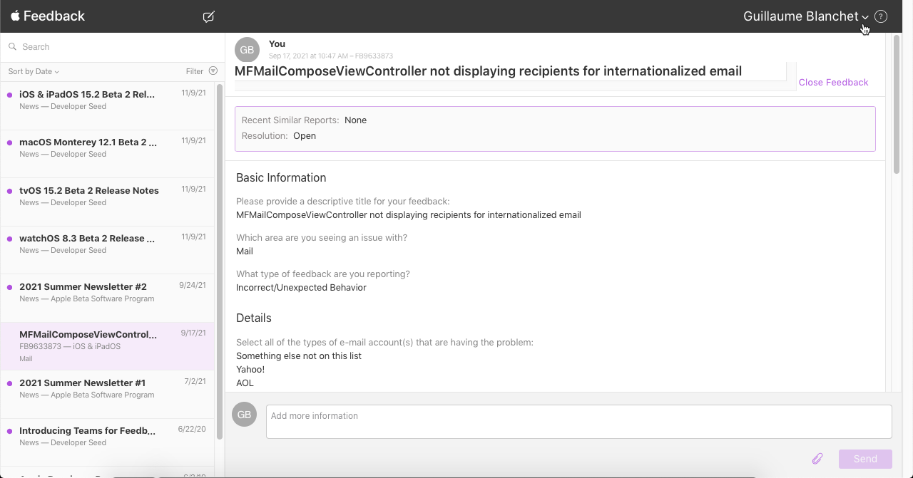
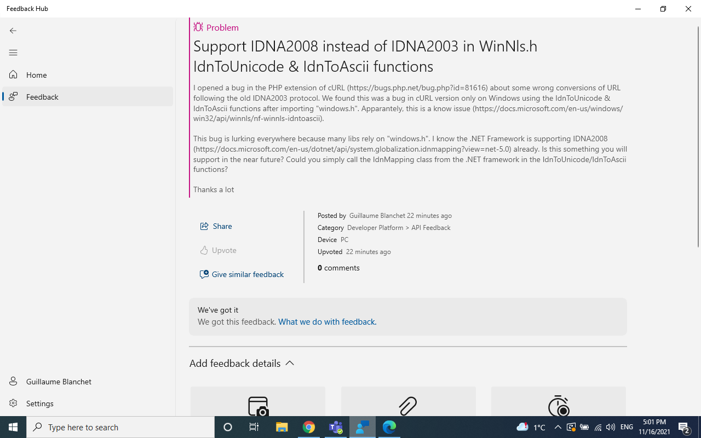

# Universal Acceptance 2021 Test Run: Conformance Testing of Libraries and Languages

This page describes the work done by Cofomo in 2021 to test the compliance of some libraries & languages towards universal acceptance.

The report \[[docx](./UA-language-testing-20211208.docx)\] \[[pdf](./UA-language-testing-20211208.pdf)\] contains the information about the methodology used, the tested languages and libraries, conformance level of the libraries and recommendations for developers.

There is also a PowerPoint presentation \[[pptx](./UA-language-testing-20220209.pptx)\] \[[pdf](./UA-language-testing-20220209.pdf)\].

The UA conformance detailed results are breakdown by platforms:

 - [iOS](./ios-test-results.html)
 - [Android](./android-test-results.html)
 - [PHP on Windows 10](./windows-test-results.html)
 - [PHP on Linux](./php-linux-test-results.html)

## Bug Reports

Here are the bug reports for each of the non-compliant tested libraries:

| Language | Platform | Library | Report | Resolution | Notes |
|---|---|---|---|---|---|
| Swift | iOS | MessageUI | [StackOverflow report](https://stackoverflow.com/questions/69213585/mfmailcomposeviewcontroller-not-displaying-recipients-for-internationalized-emai) | No answer yet | Bug has been reported on Apple's bug reporting tool but link is private. See [iOS note below](#ios-note) |
| Swift | iOS | URLSession & Alamofire | [StackOverflow report](https://stackoverflow.com/questions/69945768/swift-url-returns-nil-when-the-url-contains-an-internationalized-domain-name-id) | Being discussed | Bug has been reported on Apple's bug reporting tool but link is private |
| Swift | iOS | URLSession & Alamofire | [Bug report on Swift bugtracker](https://bugs.swift.org/browse/SR-15487) | Assigned to a maintainer | |
| PHP | Windows | mail | [Bug report on RFC6531 compliance](https://bugs.php.net/bug.php?id=81615) | Changed to feature request | There is very few chances that it would be implemented |
| PHP | Windows | cURL | [Bug report on IDNA 2008 compliance](https://bugs.php.net/bug.php?id=81616) | This is a Windows issue | The library used for IDN conversions is a windows version that is only IDNA2003 compliant |
| PHP | Windows | cURL | [Bug report on IDN 2008 compliance](https://aka.ms/AAeuxwu) | No answer yet | Windows feedback hub report, as PHP maintainers stated that the issue came from Windows |
| PHP | Windows & Linux | intl | [Bug report on IDNA 2008 compliance](https://bugs.php.net/bug.php?id=81628) | Suspended as this is an ICU issue | Unicode ICU library implements IDNA2008 according to UTS #46, see their [documentation](https://unicode-org.github.io/icu-docs/apidoc/dev/icu4c/uidna_8h.html#details) |
| PHP | Windows & Linux | PHP Mailer  | [Bug report for IDNA 2008 compliance](https://github.com/PHPMailer/PHPMailer/issues/2563) | Pull request submitted and merged upstream | |
| PHP | Windows & Linux | Symfony HttpClient  | [Bug report on IDNA 2008 compliance](https://github.com/symfony/symfony/issues/44091) | Pull request submitted and merged upstream | |
| PHP | Windows & Linux | Symfony Mailer  | [Bug report on IDNA 2008 compliance](https://github.com/symfony/symfony/issues/44092) | Pull request submitted and merged upstream | |
| PHP | Windows & Linux | Symfony Mailer  | [Bug report on RFC5322 compliance](https://github.com/symfony/symfony/issues/44094) | Being discussed | |
| PHP | Windows & Linux | Symfony Mailer  | [Bug report on RFC6531 compliance](https://github.com/symfony/symfony/issues/44136) | No answer yet | |
| Kotlin | Android | Jakarta Mail | [Bug report on RFC6531 compliance](https://github.com/eclipse-ee4j/mail/issues/589) | No answer yet | |
| Kotlin | Android | HttpUrlConnection | [Bug report on IDNA 2008 compliance](https://issuetracker.google.com/issues/206015971) | Transmitted to the engineering teams | |
| Kotlin | Android | OkHttp | [Bug report on IDNA 2008 compliance](https://github.com/square/okhttp/issues/6910) | Closed after Q&A | Maintainer closed it "as the strictness of IDNA 2008 is likely to cause more visible issues than this solves, particularly as this isn't uniformly supported or implemented by clients and servers". While major actor in the industry will stick to IDNA 2003 (e.g. Chrome browser) this is not likely to change. |
| Kotlin | Android | Fuel | [Bug report on IDNA 2008 compliance](https://github.com/kittinunf/fuel/issues/819) | Pull request submitted and pending to be merged upstream | |
| Kotlin | Android | Apache HttpClient | [Apache HttpClient](https://issues.apache.org/jira/browse/HTTPCLIENT-2185) | No answer yet | |

### iOS note

The bug report on MessageUI & URLSession points to a stackoverflow, since Apple's proprietary bug reporting tool (called Feedback Assistant) maintains reports private
between developers and the company. 

The bug is registered at both place: stackoverflow & Feedback Assistant for the benefits of the community:

For URLSession & Alamofire, the bug seems to come from the open-source version of the Foundation framework. 
We thus log the bug also on the Swift open-source bug tracker.

### Windows note

We log only two bug reports for two PHP libraries on Windows. The other libraries behave the same way on Linux & Windows. 

On Linux, the PHP mail extension uses sendmail which provides for the SMTPUTF8 extension since version 8.17. On Windows, the PHP mail extension is the Mail Transfer Agent (MTA) and would be responsible to send the SMTPUTF8 flag. 

The lib cURL contained in the PHP Windows binaries uses the "windows.h" IdnToUnicode/IdnToAscii" functions [which are known to be only IDNA2003 compliant](https://docs.microsoft.com/en-us/windows/win32/api/winnls/nf-winnls-idntounicode). We opened a [bug in the Windows's Feedback Hub for that](https://aka.ms/AAeuxwu):

### Android note

Volley is developed by Google and is part of Android, moreover, it uses HttpUrlConnection therefore the HttpUrlConnection
bug report is sufficient to cover Volley compliance.

The same goes for Retrofit that is using OkHttp stack and utils and is maintained by the same company.

### PHP Mailer note

The PHP Mailer maintainer is well aware of EAI and already got many bug reports about that. See [the latest one](https://github.com/PHPMailer/PHPMailer/issues/1440) where he mentions others therefore no bug additional bug for EAI support has been reported.
