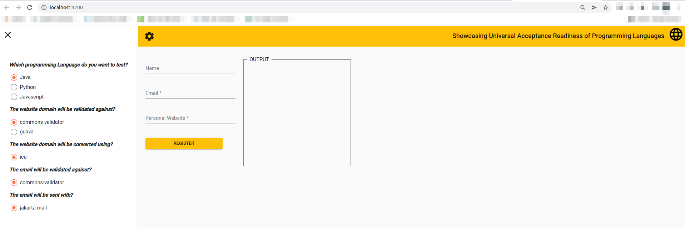
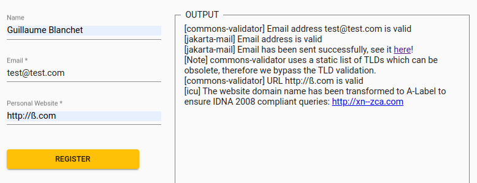

# Ui

This project was generated with [Angular CLI](https://github.com/angular/angular-cli) version 13.2.2.

## Instructions

Move up and start all backend services:

    cd ../
    docker-compose up -d

Return to "ui" folder and install dependencies:

    cd ui
    npm install

Then start the frontend:

    ./node_modules/.bin/ng serve -o

You should see this form to test each backend:

You can test the form by selecting which combination of libraries & language you want at the left and then fill it out at the right.
Once you filled out the form, press "Register" (it won't actually register anything you entered but is only there for testing purposes) and you will see
the log output of the libs & language you selected. Example given:

