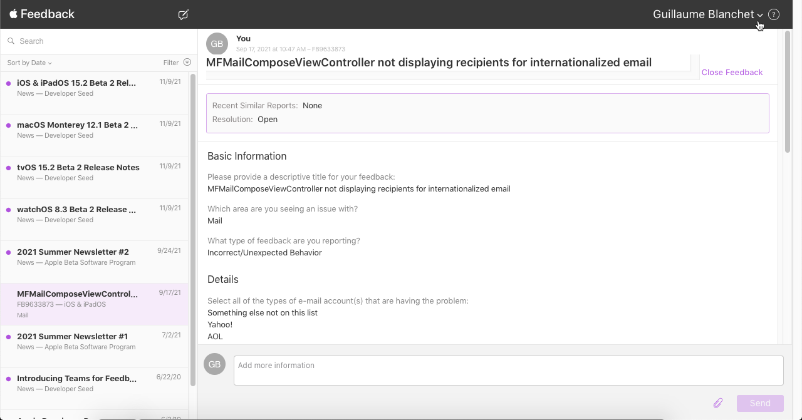
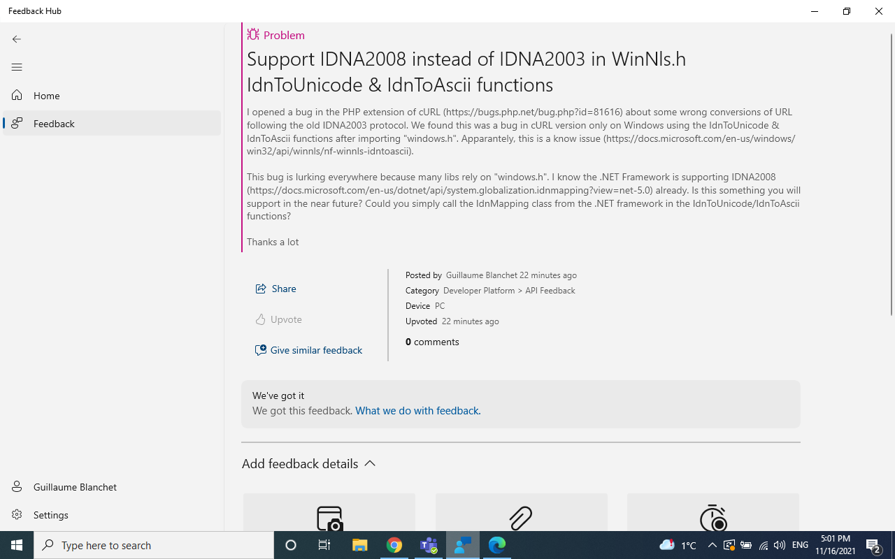

# Universal Acceptance: Conformance Testing of Librairies and Languages

This set of pages describes the work done by Cofomo on testing Programming languages and libraries against the Universal Acceptance compliance requirements. 
Three series of tests were executed: one in 2018, one in 2020 and another on 2021. 
This page describes the latest one.

## 2021 Test Run

The [report](./UA-language-testing-20210920.docx) contains the information about the methodology used, the tested languages and libraries, conformance level of the libraries and recommendations for developers.

There is also a PowerPoint [presentation](./UA-language-testing-20210920.pptx).

The UA conformance detailed results are breakdown by platforms:

 - [iOS](./ios-test-results.html)
 - [Android](./android-test-results.html)
 - [PHP on Windows 10](./windows-test-results.html)
 - [PHP on Linux](./php-linux-test-results.html)

## Bug Reports

Here are the bug reports for each of the non-compliant tested libraries:

- iOS
  - Swift
    - [MessageUI](https://stackoverflow.com/questions/69213585/mfmailcomposeviewcontroller-not-displaying-recipients-for-internationalized-emai)
    - [URL in URLSession & Alamofire](https://stackoverflow.com/questions/69945768/swift-url-returns-nil-when-the-url-contains-an-internationalized-domain-name-id)
- Windows
  - PHP
    - [mail](https://bugs.php.net/bug.php?id=81615)
    - [cURL](https://bugs.php.net/bug.php?id=81616)
- Linux & Windows
  - PHP
    - [intl](https://bugs.php.net/bug.php?id=81628)
    - [PHP Mailer](https://github.com/PHPMailer/PHPMailer/issues/2563)
    - [Symfony HttpClient](https://github.com/symfony/symfony/issues/44091)
    - [Symfony Mailer IDN2008 compliance](https://github.com/symfony/symfony/issues/44092)
    - [Symfony Mailer RFC5322](https://github.com/symfony/symfony/issues/44094)
    - [Symfony Mailer RFC6531](https://github.com/symfony/symfony/issues/44136)
- Android
  - Kotlin
    - [Jakarta Mail](https://github.com/eclipse-ee4j/mail/issues/589)
    - [HttpUrlConnection (Android)](https://issuetracker.google.com/issues/206015971)
    - [OkHttp](https://github.com/square/okhttp/issues/6910)
    - [Fuel](https://github.com/kittinunf/fuel/issues/819)
    - [Apache HttpClient](https://issues.apache.org/jira/browse/HTTPCLIENT-2185)

### iOS note

The bug report on MessageUI & URLSession points to a stackoverflow, since Apple's proprietary bug reporting tool (called Feedback Assistant) maintains reports private
between developers and the company. 

The bug is registered at both place: stackoverflow & Feedback Assistant for the benefits of the community:

For URLSession & Alamofire, the bug seems to comes from the open-source version of the Foundation framework. 
We thus log the bug also on the Swift open-source bug tracker: https://bugs.swift.org/browse/SR-15487

### Windows note

We log only two bug reports for two PHP libraries on Windows. The other libraries behave the same way on Linux & Windows. 

On Linux, the PHP mail extension uses sendmail which provides for the SMTPUTF8 extension since version 8.17. On Windows, the PHP mail extension is the Mail Transfer Agent (MTA) and would be responsible to send the SMTPUTF8 flag. 

The lib cURL contained in the PHP Windows binaries uses the "windows.h" IdnToUnicode/IdnToAscii" functions [which are known to be only IDNA2003 compliant](https://docs.microsoft.com/en-us/windows/win32/api/winnls/nf-winnls-idntounicode). We opened a [bug in the Windows's Feedback Hub for that](https://aka.ms/AAeuxwu):

### Android note

Volley is developed by Google and is part of Android, moreover, it uses HttpUrlConnection therefore the HttpUrlConnection
bug report is sufficient to cover Volley compliance.

The same goes for Retrofit that is using OkHttp stack and utils and is maintained by the same company.

### PHP Mailer note

The PHP Mailer maintainer is well aware of EAI and already got many bug reports about that. See [the latest one](https://github.com/PHPMailer/PHPMailer/issues/1440) where he mentions others therefore no bug additional bug for EAI support has been reported.
